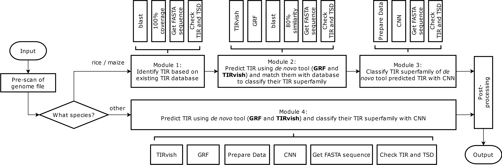

# TIR-Learner v3

[](https://github.com/lutianyu2001/TIR-Learner/releases)
[](https://github.com/lutianyu2001/TIR-Learner/blob/master/LICENSE)
[](https://github.com/lutianyu2001/TIR-Learner/actions/workflows/test.yml)
[](https://anaconda.org/bioconda/tir-learner)
[](https://anaconda.org/bioconda/tir-learner)
[](https://anaconda.org/bioconda/tir-learner)

TIR-Learner is an ensemble pipeline for Terminal Inverted Repeat (TIR) transposable elements annotation in eukaryotic genomes. Version 3 represents a complete redesign and rewrite, focusing on enhancing efficiency, improving compatibility, and ensuring code quality.

## Table of Contents

- [Background](#background)
- [New in Version 3](#new-in-version-3)
- [Installation](#installation)
- [Usage](#usage)
- [Program Workflow](#program-workflow)
- [Output Files](#output-files)
- [Algorithm Details](#algorithm-details)
- [Performance Improvements](#performance-improvements)
- [Contributing](#contributing)
- [Citation](#citation)
- [Credits](#credits)
- [License](#license)

## Background

Transposable elements (TEs) are DNA sequences that can move within a genome. Terminal Inverted Repeat (TIR) transposons are a specific type of TE characterized by inverted repeat sequences at their ends. These TIRs act like bookends, marking the beginning and end of the transposable element and helping enzymes recognize and move the element.

TIR-Learner combines multiple approaches to identify and classify TIR transposons:
- Homology-based detection using curated reference libraries
- De novo structural identification
- Machine learning classification into TIR superfamilies

## New in Version 3

### Improved Efficiency

- Reduced I/O operations through in-memory data processing using Pandas DataFrames
- Multiprocessing support for both TIRvish and GRF tools
- Optimized sequence processing algorithms
  
### Enhanced Compatibility

- Updated dependencies for better maintainability
- New conda recipe for easier installation
- Pytorch backend for the CNN model

### New Features

- Automatic genome file pre-scanning and validation
- Checkpoint system for progress recovery
- Overlap detection and simplification in results
- Additional parallel execution modes
- Progress tracking and verbose output options

## Installation

### Using Conda/Mamba (Recommended)

*If you do not have conda/mamba installed, you are strongly recommended to use Miniforge. For more information, please refer to [conda-forge/miniforge](https://github.com/conda-forge/miniforge).*

Note: In all installation commands, `-c conda-forge` MUST be specified before `-c bioconda` to ensure conda-forge is having higher priority over bioconda so that the latest packages are installed (according to [Channels: Specifying channels when installing packages](https://docs.conda.io/projects/conda/en/latest/user-guide/concepts/channels.html#specifying-channels-when-installing-packages)).

#### Install with a new environment

You can create a new environment with any name (we use `TIRLearner_env` as an example) and install TIR-Learner in it using the following one-liner command:

```shell
mamba create -n TIRLearner_env -c conda-forge -c bioconda tir-learner
```

#### Install in an existing environment

```shell
mamba install -c conda-forge -c bioconda tir-learner
```

#### Enforce PyTorch Build (CUDA or CPU-only)

Sometimes users may want to force PyTorch to use CPU only (or conversely force using CUDA). For example, while HPC nodes may have GPUs that trigger conda to automatically install CUDA-enabled PyTorch builds, users without GPU access permissions will encounter runtime errors while using TIR-Learner. 

In such cases, you can specify a CPU-only PyTorch build by adding `"pytorch=*=*cpu*"` in the installation commands. For instance:

```shell
mamba create -n TIRLearner_env -c conda-forge -c bioconda tir-learner "pytorch=*=*cpu*"
```

Similarly, you can add `"pytorch=*=*cuda*"` in the installation commands to enforce CUDA usage.


### Manual Installation

Clone the repository and install all the dependencies. `TIR-Learner.py` is the entry point of the program.

#### Dependencies

- Python >=3.8
- BLAST
- GenomeTools (gt)
- GRF (Generic Repeat Finder)
- Required Python packages:
  - biopython
  - keras >=3.3.3
  - pandas
  - pytorch
  - regex
  - scikit-learn >=1.3
  - swifter

## Usage

```shell
TIR-Learner [-h] [-v] -f GENOME_FILE -s SPECIES [-n GENOME_NAME] [-l LENGTH] [-p PROCESSOR] [-w WORKING_DIR] [-o OUTPUT_DIR] [-c [CHECKPOINT_DIR]] [--verbose] [-d] [--grf_path GRF_PATH] [--gt_path GT_PATH] [-a ADDITIONAL_ARGS]
```

### Program Information

- `-h, --help`
  - Show help message and exit
- `-v, --version`
  - Show version information and exit

### Required Arguments

- `-f, --genome_file`
  - Genome file in FASTA format
  - Must be properly formatted with unique sequence names

- `-s, --species`
  - Species specification for analysis
  - Options:
    - `rice`: Use rice-specific TIR reference library
    - `maize`: Use maize-specific TIR reference library
    - `others`: Use general analysis pipeline without species-specific references
  - Affects which processing path (Part A or B) will be used

### Optional Arguments

#### Basic Configuration

- `-n, --genome_name` (default: "TIR-Learner")
  - Name prefix for output files
  - Used in naming temporary files and final results
  - Avoid using special characters

- `-l, --length` (default: 5000)
  - Maximum length of TIR transposons to detect

- `-p, -t, --processor` (default: all available CPU cores)
  - Number of processors to use for parallel operations


<!-- #### Execution Mode

- `-m, --mode` (default: "pyboost")
  - Parallel execution mode for the program
  - Options:
    - `pyboost`: Maximum resource utilization, fastest execution
    - `pystrict`: Controlled resource usage, better for shared systems
    - `gnup`: GNU Parallel implementation (experimental)
  - Affects how computational resources are allocated -->

#### Directory Configuration

- `-w, --working_dir` (default: temporary directory in `/tmp`)
  - Directory for storing temporary files
  - Will be automatically cleaned unless in debug mode
  - Requires sufficient disk space for temporary files

- `-o, --output_dir` (default: genome file directory)
  - Directory for final output files
  - Will be created if it doesn't exist
  - Must have write permissions

- `-c, --checkpoint_dir`
  - Directory for checkpoint files **to load**
  - Note: Checkpoint files will always be saved in the **output directory** by default, so this option is only used to load checkpoints from a different directory
  - Options:
    - Specify with path (e.g. `-c /path/to/checkpoint`): Use given directory for checkpoints
    - Specify without path (e.g. `-c`): Automatically search in genome file and output directories
    - Do not specify: No checkpoint loading

#### Debug and Verbose Options

- `--verbose`
  - Enable detailed progress output
  - Shows user-friendly progress bars

- `-d, --debug`
  - Enable debug mode
  - Keeps all temporary files
  - Stores additional checkpoint information

#### Path Configuration

- `--grf_path`
  - Path to GRF (Generic Repeat Finder)
  - Required if GRF is not in system PATH
  - Must point to directory containing grf-main

- `--gt_path`
  - Path to genometools
  - Required if genometools is not in system PATH
  - Must point to directory containing gt

#### Additional Arguments

- `-a, --additional_args`
  - Additional arguments to pass to the program
  - Pass additional options individually using -a for each option  
    Examples:
    - Single option: `-a CHECKPOINT_OFF`
    - Multiple options: `-a CHECKPOINT_OFF -a SKIP_TIRVISH`

Available options:

- `CHECKPOINT_OFF`
  - Completely disables checkpoint system
  - No checkpoints will be saved or loaded
  - Useful for one-off runs or when disk space is limited

- `NO_PARALLEL`
  - Disables multi-processing
  - Forces serial execution of computation-intensive steps
  - Useful for debugging or on systems with limited resources

- `SKIP_TIRVISH`
  - Skips TIRvish analysis step
  - Reduces runtime but may miss some TIRs
  - Cannot be used together with SKIP_GRF

- `SKIP_GRF`
  - Skips GRF analysis step
  - Reduces runtime but may miss some TIRs
  - Cannot be used together with SKIP_TIRVISH

### Example

```bash
TIR-Learner -f ./test/genome.fa -s others -p 2 -l 5000 -c ./ -w ./test/ -d --verbose
```

## Program Workflow

<div style="text-align:center; width: 100%">
<br>
<picture>
  <source media="(prefers-color-scheme: dark)" srcset="./docs/TIR-Learner3_workflow_white.drawio.png">
  
</picture>
<br><br>
</div>

TIR-Learner v3 consists of two main processing paths:

### Part A (Rice and Maize)
Uses three consecutive modules:
1. **Module 1**: Identify TIR based on existing TIR database
2. **Module 2**: Predict TIR using de novo tool and match them with database to classify their TIR superfamily
3. **Module 3**: Classify TIR superfamily of de novo tool predicted TIR with CNN

### Part B (Other Species)
Uses a single module:
- **Module 4**: Predict TIR using de novo tool and classify their TIR superfamily with CNN

### Processing Flow
1. Pre-scan genome file
2. Route to Part A or B based on species
3. Execute relevant modules
4. Post-process results
    - Combine predictions
    - Remove overlaps
    - Generate final output

## Output Files

TIR-Learner generates four output files in the `TIR-Learner-Result` directory:

### Raw Results

1. GFF3 annotation file: `<genome_name>_FinalAnn.gff3`
   - Contains predicted TIR locations and classifications
   - Includes TIR and TSD details in attributes

2. FASTA sequence file: `<genome_name>_FinalAnn.fa`
   - Contains extracted sequences for predicted TIRs
   - Headers include location and classification information

### Filtered Results

1. GFF3 annotation file: `<genome_name>_FinalAnn_filter.gff3`
2. FASTA sequence file: `<genome_name>_FinalAnn_filter.fa`

## Algorithm Details

### TIR Detection

- Minimum TIR length: 10bp
- Maximum TIR length: 1000bp
- Maximum TIR distance: 5000bp (default)
- Minimum similarity: 80%

### TSD Validation

Superfamily-specific TSD patterns:
- DTA: 8bp
- DTC: 2-3bp
- DTH: 3bp (TWA)
- DTM: 7-10bp
- DTT: 2bp (TA)

### CNN Classification

- Uses sequence fragments from TIR regions
- Classifies into five major TIR superfamilies
- Trained on curated datasets

## Performance Improvements

### I/O Optimization
- Reduced temporary file generation
- In-memory data processing using Pandas
- Minimized external storage operations

### Parallel Processing
- Python multiprocessing for TIRvish and GRF
- Swifter for pandas DataFrame parallel processing
<!-- - Three parallel execution modes:
  - pyboost: Maximum resource utilization
  - pystrict: Controlled resource usage
  - gnup: GNU Parallel implementation -->

## Contributing

Contributions are very welcome! Please feel free to submit a Pull Request.

## Citation

<!-- If you use TIR-Learner in your research, please cite:
```
[Citation information to be added upon publication]
``` -->

The manuscript of TIR-Learner v3 is currently in preparation. Presentation slides:

[TIR-Learner v3: New generation TE annotation program for identifying TIRs](https://doi.org/10.6084/m9.figshare.26082574.v1)

Previous versions:

- TIR-Learner v2 (Part of EDTA v1):  
[Benchmarking transposable element annotation methods for creation of a streamlined, comprehensive pipeline](https://doi.org/10.1186/s13059-019-1905-y)
- TIR-Learner v1:  
[TIR-Learner, a New Ensemble Method for TIR Transposable Element Annotation, Provides Evidence for Abundant New Transposable Elements in the Maize Genome](https://doi.org/10.1016/j.molp.2019.02.008)

## Credits

### Previous Versions
Special thanks to [@oushujun](https://github.com/oushujun) and [@WeijiaSu](https://github.com/WeijiaSu) for their fantastic work on TIR-Learner v1 and v2! Their foundational work made this improved version possible.

### Acknowledgments
This work was supported by:
- [The Ou Lab at The Ohio State University](https://www.ou-lab.org/)
- [The Ohio Supercomputer Center](https://www.osc.edu/)
- [OSU Undergraduate Research Access Innovation Seed Grant](https://ugresearch.osu.edu/faculty/funding-and-grants)

The development of TIR-Learner v3 would not have been possible without their generous support in providing opportunities, resources, and platforms for this research.

## License

This project is licensed under the GPL-3.0 License - see the [LICENSE](LICENSE) file for details.
