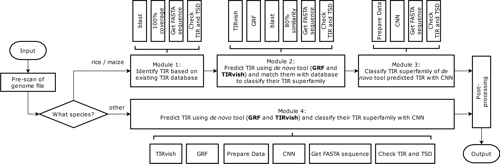

# TIR-Learner v4

TIR-Learner is an ensemble pipeline for Terminal Inverted Repeat (TIR) transposable elements annotation in eukaryotic genomes. Version 4 is a complete rewrite of v3, greatly reducing runtimes and vastly reducing the amount of RAM required to process larger genomes.

## Table of Contents

- [Background](#background)
- [New in Version 3](#new-in-version-3)
- [Installation](#installation)
- [Usage](#usage)
- [Program Workflow](#program-workflow)
- [Output Files](#output-files)
- [Algorithm Details](#algorithm-details)
- [Performance Improvements](#performance-improvements)
- [Contributing](#contributing)
- [Citation](#citation)
- [Credits](#credits)
- [License](#license)

## Background

Transposable elements (TEs) are DNA sequences that can move within a genome. Terminal Inverted Repeat (TIR) transposons are a specific type of TE characterized by inverted repeat sequences at their ends. These TIRs act like bookends, marking the beginning and end of the transposable element and helping enzymes recognize and move the element.

TIR-Learner combines multiple approaches to identify and classify TIR transposons:
- Homology-based detection using curated reference libraries
- De novo structural identification
- Machine learning classification into TIR superfamilies

## New in Version 4

### Improved Efficiency

- A more efficient divide-and-conquer approach to genome chunking, sequence retrieval vastly accelerates program runtimes
- Massive reduction in number of files produced at any given time
- Substantially reduced I/O
- Filtering operations moved to their earliest possible locations in the pipeline; invalid sequences get removed as soon as possible and before downstream processing
- More efficient algorithms for data cleaning implemented in many places
  
### Enhanced Compatibility

- Fewer, less complex dependencies for better maintainability (removed Pandas, SciKit Learn, Swifter, BioPy, regex)

### New Features

- Enhanced checkpoint system records compact partial results
- Checkpoint files are kept post-run, can be reused by TIR-Learner in reruns (unlikely but nice to have)
- Checkpoint files improve data transparency

## Installation

### Using Conda/Mamba (Recommended)

*If you do not have conda/mamba installed, you are strongly recommended to use Miniforge. For more information, please refer to [conda-forge/miniforge](https://github.com/conda-forge/miniforge).*

Note: In all installation commands, `-c conda-forge` MUST be specified before `-c bioconda` to ensure conda-forge is having higher priority over bioconda so that the latest packages are installed (according to [Channels: Specifying channels when installing packages](https://docs.conda.io/projects/conda/en/latest/user-guide/concepts/channels.html#specifying-channels-when-installing-packages)).

#### Install with a new environment

You can create a new environment with any name (we use `TIRLearner_env` as an example) and install TIR-Learner in it using the following one-liner command:

```shell
mamba create -n tirlearner -c bioconda -c conda-forge -c nanoporetech numpy pigz blast genericrepeatfinder genometools-genometools pywfa pyfastx pytorch keras
```

### Manual Installation

Clone the repository and install all the dependencies. `TIR-Learner.py` is the entry point of the program.

#### Dependencies

- Python >=3.8
- BLAST
- GenomeTools (gt)
- GRF (Generic Repeat Finder)
- pigz
- Required Python packages:
  - keras >=3.3.3
  - pytorch
  - numpy
  - pyfastx
  - pywfa

## Usage

```shell
TIR-Learner [-h] -f GENOME_FILE -s SPECIES [-l LENGTH] [-p PROCESSOR] [-o OUTPUT_DIR] 
```

### Program Information

- `-h, --help`
  - Show help message and exit

### Required Arguments

- `-f, --genome_file`
  - Genome file in FASTA format
  - Must be properly formatted with unique sequence names

- `-s, --species`
  - Species specification for analysis
  - Options:
    - `rice`: Use rice-specific TIR reference library
    - `maize`: Use maize-specific TIR reference library
  - Affects which processing path (Part A or B) will be used

### Optional Arguments

#### Basic Configuration

- `-n, --genome_name` (default: "TIR-Learner")
  - Name prefix for output files
  - Used in naming temporary files and final results
  - Avoid using special characters

- `-l, --length` (default: 5000)
  - Maximum length of TIR transposons to detect

- `-p, -t, --processor` (default: all available CPU cores)
  - Number of processors to use for parallel operations

#### Directory Configuration
- `-o, --output_dir` (default: genome file directory)
  - Directory for final output files
  - Will be created if it doesn't exist
  - Must have write permissions
    
## Program Workflow

<div style="text-align:center; width: 100%">
<br>
<picture>
  <source media="(prefers-color-scheme: dark)" srcset="./docs/TIR-Learner3_workflow_white.drawio.png">
  
</picture>
<br><br>
</div>

TIR-Learner v3 consists of two main processing paths:

### Part A (Rice and Maize)
Uses three consecutive modules:
1. **Module 1**: Identify TIR based on existing TIR database
2. **Module 2**: Predict TIR using de novo tool and match them with database to classify their TIR superfamily
3. **Module 3**: Classify TIR superfamily of de novo tool predicted TIR with CNN

### Part B (Other Species)
Uses a single module:
- **Module 4**: Predict TIR using de novo tool and classify their TIR superfamily with CNN

### Processing Flow
1. Pre-scan genome file
2. Route to Part A or B based on species
3. Execute relevant modules
4. Post-process results
    - Combine predictions
    - Remove overlaps
    - Generate final output

## Output Files

TIR-Learner generates four output files in the `TIR-Learner-Result` directory:

### Raw Results

1. GFF3 annotation file: `<genome_name>_FinalAnn.gff3`
   - Contains predicted TIR locations and classifications
   - Includes TIR and TSD details in attributes

2. FASTA sequence file: `<genome_name>_FinalAnn.fa`
   - Contains extracted sequences for predicted TIRs
   - Headers include location and classification information

### Filtered Results

1. GFF3 annotation file: `<genome_name>_FinalAnn_filter.gff3`
2. FASTA sequence file: `<genome_name>_FinalAnn_filter.fa`

## Algorithm Details

### TIR Detection

- Minimum TIR length: 10bp
- Maximum TIR length: 1000bp
- Maximum TIR distance: 5000bp (default)
- Minimum similarity: 80%

### TSD Validation

Superfamily-specific TSD patterns:
- DTA: 8bp
- DTC: 2-3bp
- DTH: 3bp (TWA)
- DTM: 7-10bp
- DTT: 2bp (TA)

### CNN Classification

- Uses sequence fragments from TIR regions
- Classifies into five major TIR superfamilies
- Trained on curated datasets

## Performance Improvements

### I/O Optimization
- Reduced temporary file generation
- In-memory data processing using Pandas
- Minimized external storage operations

### Parallel Processing
- Python multiprocessing for TIRvish and GRF
- Swifter for pandas DataFrame parallel processing
<!-- - Three parallel execution modes:
  - pyboost: Maximum resource utilization
  - pystrict: Controlled resource usage
  - gnup: GNU Parallel implementation -->

## Contributing

Contributions are very welcome! Please feel free to submit a Pull Request.

## Citation

<!-- If you use TIR-Learner in your research, please cite:
```
[Citation information to be added upon publication]
``` -->

The manuscript of TIR-Learner v3 is currently in preparation. Presentation slides:

[TIR-Learner v3: New generation TE annotation program for identifying TIRs](https://doi.org/10.6084/m9.figshare.26082574.v1)

Previous versions:

- TIR-Learner v2 (Part of EDTA v1):  
[Benchmarking transposable element annotation methods for creation of a streamlined, comprehensive pipeline](https://doi.org/10.1186/s13059-019-1905-y)
- TIR-Learner v1:  
[TIR-Learner, a New Ensemble Method for TIR Transposable Element Annotation, Provides Evidence for Abundant New Transposable Elements in the Maize Genome](https://doi.org/10.1016/j.molp.2019.02.008)

## Credits

### Previous Versions
Special thanks to [@oushujun](https://github.com/oushujun) and [@WeijiaSu](https://github.com/WeijiaSu) for their fantastic work on TIR-Learner v1 and v2! Their foundational work made this improved version possible.

### Acknowledgments
This work was supported by:
- [The Ou Lab at The Ohio State University](https://www.ou-lab.org/)
- [The Ohio Supercomputer Center](https://www.osc.edu/)
- [OSU Undergraduate Research Access Innovation Seed Grant](https://ugresearch.osu.edu/faculty/funding-and-grants)

The development of TIR-Learner v3 would not have been possible without their generous support in providing opportunities, resources, and platforms for this research.

## License

This project is licensed under the GPL-3.0 License - see the [LICENSE](LICENSE) file for details.
